# SEEM — a fitted law for yield events, and everything rebuilt from it

This is the second pass over the SEEM dataset, and it inverts the logic of the
first. Last time we *measured* the plastic response of the glass voxel by voxel
and asked what functions describe the measurements. This time we go after the
project's original target directly: **the probability distribution of yield
events**. We fit one law for the event statistics — with the functional form
*discovered by symbolic regression, not assumed* — and then re-derive every
downstream quantity (mean event sizes, the plastic-rate field, its factor
structure, and finally full synthetic stress–strain curves for all 850
simulations) **from the fitted law**, side by side with the directly measured
version of each quantity. Where the two versions agree, the law is carrying the
physics. Where they disagree, we say so.

The first-pass technical report ([REPORT.md](REPORT.md)) and its figures are
unchanged and still valid; this document supersedes the old README.
Section 9 was added in a third pass: it locates the preparation memory that
Sections 6 and 8 flagged, repairs the model's failure mode with one parameter,
shows that memory relaxes with strain, answers the sample-maximum objection to
the ceiling, and finds the one place the Markov assumption fails outright
(aftershocks). Everything here is
regenerated by `pipeline/run_all.sh` (Section 12).

---

## 1. The data, briefly

850 athermal quasistatic (AQS) shear trajectories of a model glass: strain is
applied in steps of Δγ = 10⁻⁵ up to γ = 0.5 (49,999 steps each), with the
system energy-minimized at every step. Nine preparation histories — cooling
rates from 2×10¹⁰ to 5.12×10¹² K/s in factors of two — with 100 runs each (50
at the fastest). Each step records the shear stress and the per-atom potential
energy: 42.5 million rows total.

In AQS dynamics every strain step is one of two things: a smooth **elastic**
increment, or a discontinuous **event** (a plastic rearrangement). That
dichotomy is not a modeling choice, it is what the algorithm does — which is
why the model below has the structure it has.

## 2. The variables, all in one place

| symbol | plain reading |
|---|---|
| γ | applied shear strain; one step = 10⁻⁵ |
| τ | shear stress (raw stress ÷ 10⁴, the lab convention) |
| u | per-atom potential energy above a reference: u = pe − u₀, with u₀ = −4.60752 taken from the dataset. High u = poorly annealed, "young" glass |
| (u, τ) | the two-coordinate **state** of a run; all fields below live on a 20×20 grid over this plane |
| 2μ(u,τ) | elastic modulus: the slope dτ/dγ on elastic steps (≈ 20 in these units) |
| event, s | a step where stress drops; its **size** s = −Δτ. 187,468 of them in the dataset, spanning s ≈ 10⁻⁶ to 1.16 |
| aging event | a step where energy drops but stress does not (105,188 of them, 36% of all events); they relax u without releasing stress |
| p(u,τ) | event **hazard**: probability per step that an event fires (median ≈ 0.3%/step) |
| P(s \| u,τ) | the size distribution — *the object this whole pass is about* |
| k | the law's small-size exponent: P(s) ∼ s⁻ᵏ for small s. Fitted k = 0.88 |
| s_c(u,τ) | the **ceiling**: the largest event the state (u,τ) can produce. The law's only state-dependent parameter |
| m | the ceiling exponent: P(s) vanishes like (s_c − s)ᵐ at the ceiling. Fitted m = 2.3 |
| ε | a tiny rounding scale (≈ 3×10⁻⁵) below which the power law flattens; resolution-limited |
| ξ | rescaled size (s+ε)/(s_c+ε): in this variable every cell has the *same* distribution |
| q(u,τ) | plastic fraction of the strain rate: q = 1 − (dτ/dγ)/2μ. 0 = purely elastic, 1 = steady flow |
| Λ(u), f(τ) | the two factors of q ≈ Λ(u)·f(τ) (and analogously for ln s_c) |
| "rank-1" | how much of a field's (log) variance a product of one-variable factors captures — 96% for q, 96% for s_c |

## 3. The model: three measured fields and one law to discover

Because AQS is literally "drift, then jump", the generative model is fixed by
the dynamics itself; the only scientific freedom is in the ingredients:

1. **Elastic drift** — τ rises at 2μ(u,τ), u drifts slightly; both measured
   directly from elastic steps.
2. **When events fire** — the hazard p(u,τ), measured as a per-voxel event
   fraction.
3. **How big they are** — P(s | u,τ), *the part we fit*, plus a linear
   coupling giving the energy change per event and an exponential model for
   the (small) aging channel.

Everything is tabulated on a 20×20 grid over (u,τ) (equal-width bins between
the 0.2% and 99.8% quantiles, plus a catch-all outer ring so a simulation can
never step off the map). Ingredient 3 is where the physics lives, and it is
the one we refused to write down by hand.

## 4. Finding the form: exhaustive symbolic regression

**Expect this component to draw the most scrutiny, so here is exactly what was
done.** The search uses [library/symreg.py](library/symreg.py), a purpose-built
engine with one deliberate property: for one-variable targets it does not
sample the space of formulas, it **enumerates all of them** up to a complexity
budget, so "the search did not find X" is a checkable statement, not a claim
about luck.

**The target.** For a given grid cell (a narrow window of u and τ, inside
which the state is effectively constant), take all its event sizes, bin them
in 19 logarithmic bins, and form the log-density ln ρ(s) with Poisson error
bars (1/√count per bin). The regression target is y = ln ρ(s) vs x = s.

**The grammar.** Expressions are trees built from x, fitted constants, six
unary operators (exp, log, 1/·, (·)², √, −) and four binary ones (+, −, ×, ÷).
Each expression may carry at most two internal constants, fitted by
Levenberg–Marquardt with 4 restarts, while the outer scale and offset
a·f(x)+b are solved in closed form (variable projection) — so every candidate
is optimized, not just evaluated. Transcendentals cost 2 complexity units,
everything else 1, which makes the search prefer plain algebra unless the
data insists otherwise.

**The scale.** At complexity ≤ 8, the enumeration visits **624,936 trees per
target**; a numerical fingerprint (invariant to the outer scale/offset,
evaluated on a log-spaced probe so behavior at small s is not aliased)
collapses these to ~14,000 genuinely distinct functions, of which ~10,300
survive the admissibility filter (finite and monotonically decreasing over
the fit window). This was run on **12 cells** spread over the (u,τ) grid
(4 orders of magnitude in event size, 700–7,600 events each), plus four
variants — two cells re-run with unweighted bins and two with the fit window
extended toward smaller sizes — to expose the two systematics that dominated
form-selection in the first pass. One **deep run at complexity ≤ 9 enumerated
4,505,024 trees** (68,305 distinct, 48,725 admissible) on the largest cell to
check that nothing qualitatively new appears with more budget. It doesn't.

**What came out.** Every one of the 16 fronts tells the same story. The
canonical truncated power law s⁻ᵏe^(−s/s*) — which sits *inside* this search
space at complexity 7 — **never appears on a single Pareto front**. What
recurs instead, across cells, weightings, and windows, is the structure
`log(1/(s+ε) − C)`, which algebra rearranges into

$$\rho(s) \;\propto\; \frac{(s_c-s)^{m}}{(s+\varepsilon)^{k}},\qquad 0<s<s_c$$

a power-law decay that does not fade out exponentially but **terminates at a
finite ceiling s_c**, just above the largest observed event. Physically that
is a finite-size statement: a finite simulation cell has a largest possible
stress release, and the data are near enough to it to see it.

**Symbolic regression proposes; likelihood disposes.** Binned least squares is
a blunt instrument — it over-weights the crowded small-size bins, and one
seductive low-complexity form it produced, √log(c/s), turned out to be pure
binning artifact (likelihood demolished it at ΔAIC ≈ +20,000). So every form
the search surfaced was promoted to a properly normalized probability density
and made to compete by maximum likelihood — against the truncated power law,
stretched cutoffs, the lognormal, and a bounded pure power law — under AIC
and under **trajectory-blocked two-fold cross-validation** (events from the
same run are correlated, so runs, not events, are what we split). Figures
1–4 walk through the result of that trial, one figure at a time.

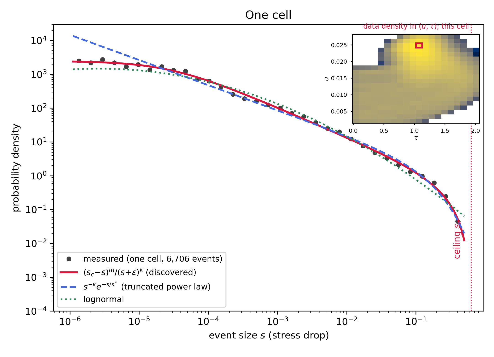

**Figure 1 — one cell, one distribution, three candidate laws.** A single
well-populated cell of the state grid, with its full range of event sizes —
five decades — on log-log axes. The inset locates that cell (red box) on the
dataset's probability density over the (u,τ) plane, at the well-sampled
high-u ridge. Black points: the measured density. Red: the
discovered ceiling law. Blue dashed: the best truncated power law (TPL).
Green dotted: the best lognormal. All three are honest maximum-likelihood
fits of proper densities. The ceiling law is the only one that captures both
ends — the flattening below s ≈ 3×10⁻⁵ (the ε rounding) *and* the abrupt
termination at the dotted vertical line (the ceiling s_c), where the TPL's
exponential tail decays too softly and overshoots. In numbers: on the full
range the ceiling law beats the TPL by ΔAIC ≈ 200–345 per cell, and at the
conventional analysis window (s ≥ 10⁻⁴) its free-exponent version wins AIC
in **8 of 8** well-populated cells (margins 67–120 vs TPL, 300–750 vs
lognormal) and wins cross-validation in 5 of 8, with the stretched-cutoff
TPL close behind in the other three.

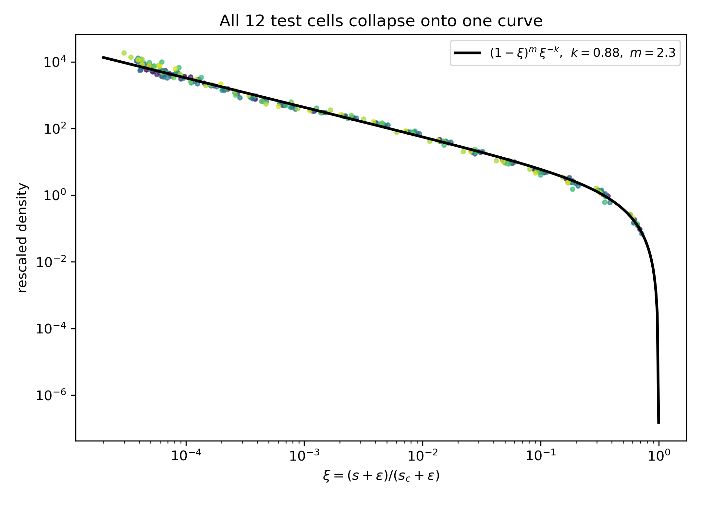

**Figure 2 — the universality claim in one plot.** Every test cell's density,
replotted against the rescaled size ξ = (s+ε)/(s_c+ε); each cell contributes
*its own fitted normalization only* — no per-cell shape freedom. All 12
cells, whose raw distributions differ by two orders of magnitude in scale,
fall on the single black curve (1−ξ)ᵐ ξ⁻ᵏ, including the bend into the
ceiling at ξ → 1. This is the strongest visual statement of the result:
**one shape, one state-dependent number.**

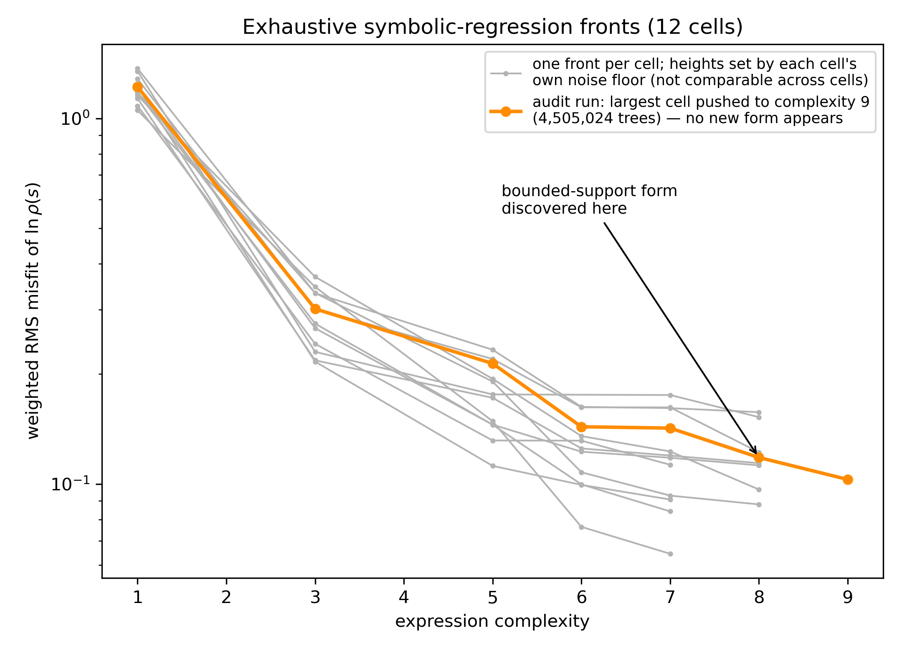

**Figure 3 — the discovery process itself, so it can be audited.** Each grey
line is one cell's exact Pareto front: the best achievable misfit at each
expression complexity. Heights are **not comparable between curves** — each
cell's misfit is weighted by its own Poisson error bars, so a curve's level
reflects that cell's event count and noise floor, not the quality of its
formula; the meaningful reading is where each front stops dropping. Orange
is the audit run, not a winner: the largest cell re-searched with the budget
pushed one complexity unit further (4.5 million trees, 7× the standard
budget) to certify that no new form appears past the ceiling-law knee at
complexity 8. Because the enumeration is exhaustive, "the TPL never made a
front" is a statement about this grammar and this data, not about search
luck.

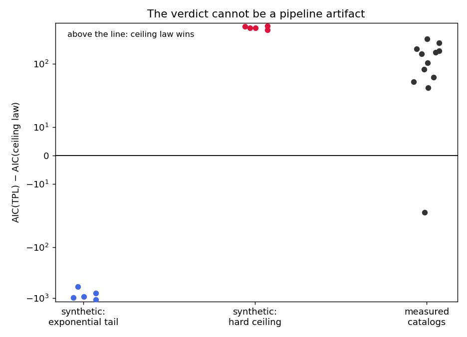

**Figure 4 — the verdict cannot be a pipeline artifact.** The falsifiability
control: synthetic catalogs of matched size were generated from a *known*
TPL (exponential tail) and from a known ceiling law, and the identical
machinery was run on both. Each dot is one fitted catalog; height is the AIC
margin, and points above the line mean the ceiling law wins. Left column: on
TPL-generated data the verdict is TPL, five seeds out of five (the ceiling
fit betrays its own degeneracy by pinning its ceiling to the sample maximum,
and the SR knee comes out as `log(x) − c·x` — exactly the TPL — with no
bounded form in sight). Middle: on ceiling-law data the verdict is the
ceiling, five of five, with ε and s_c recovered to a few percent. Right: the
twelve measured catalogs. Eleven sit decisively on the ceiling side; one
sparse cell is a statistical tie. **The discriminator works in both
directions, and the data lands on one side of it.**

## 5. The law

$$\boxed{\;P(s \mid u,\tau) \;=\; \frac{1}{Z}\,\frac{\bigl(s_c(u,\tau)-s\bigr)^{m}}{(s+\varepsilon)^{k}}\,,\qquad
k = 0.88,\quad m = 2.3,\quad \varepsilon = 2.8\times10^{-5}\;}$$

Three global constants; **all** dependence on state — and, Section 6, on
preparation history — enters through the single ceiling field s_c(u,τ). The
law needs no lower cutoff: ε lets it describe every recorded event down to
s = 10⁻⁶.

Stated at the confidence each piece deserves:

- **Solid.** A power-law size regime with k ≈ 0.9, and a large-size
  termination *sharper than exponential* wherever the statistics can tell
  the difference. Both survive reweighting, window changes, cross-validation,
  and the synthetic controls.
- **Softer.** The exact exponents move with fitting window: k ∈ [0.85, 1.03],
  m ∈ [1.6, 2.7] across treatments. (Symbolic regression's complexity budget
  first delivered the law with m tied to k; likelihood then demanded the
  decoupling, m > k.) In sparse cells m and s_c degenerate toward the
  exponential-tail limit — a ceiling needs events near it to be visible.
- **Open.** A hard ceiling begs to be a finite-size effect, and its scaling
  with system size N is the natural test — but N is not recorded in this
  dataset. Worth chasing.

## 6. The ceiling field s_c(u,τ)

With the shape frozen, one number per grid cell — the ceiling — was fit by
maximum likelihood in each of 277 cells (median bootstrap uncertainty 6.5%
on ln s_c).

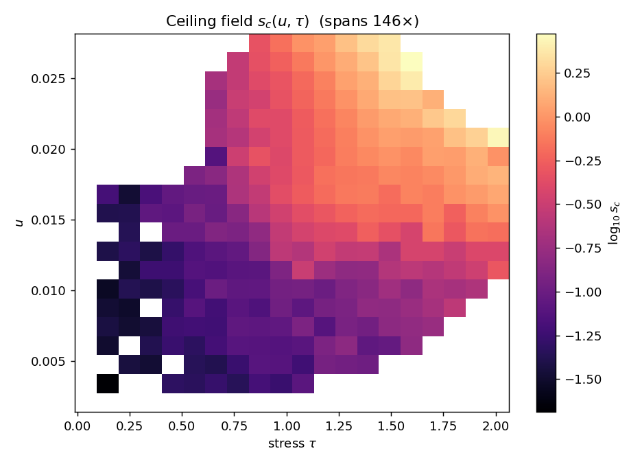

**Figure 5 — the ceiling field itself.** The largest possible event, mapped
over the state plane: it grows from ≈ 0.02 in the cold, low-stress corner to
≈ 3 at high u and τ — a **146× range**. Read it as a map of fragility: the
same glass, depending on where it sits in (u,τ), can at most release either
a tiny flicker of stress or nearly its entire load in one avalanche.

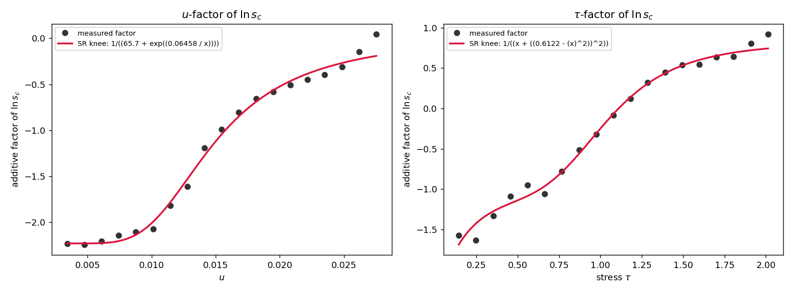

**Figure 6 — the ceiling factorizes.** The field is a product:
ln s_c(u,τ) = (u-factor) + (τ-factor) captures 95.6% of the weighted
variance, and the two panels show the two measured factors (points) with the
form symbolic regression finds for each (red; same exhaustive protocol as
Section 4, applied to the factors). The u-factor's discovered form contains
`exp(0.065/u)` — an activated, Boltzmann-like dependence on 1/u, the
STZ-flavored structure showing up uninvited in the *event-scale* field. The
τ-factor is a stiff saturating rise. We display these as discovered
parameterizations, not established physics: at factor level several forms
tie within noise — that ambiguity was the central lesson of the first pass,
and it has not gone away.

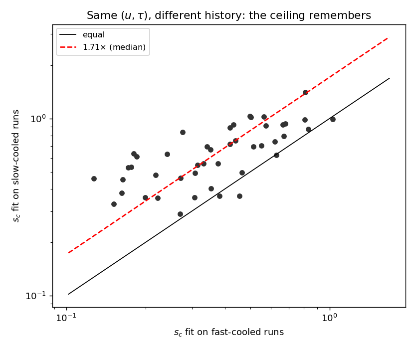

**Figure 7 — the model's hidden-variable problem, localized.** The ceiling
was refit twice per cell — once from slow-cooled runs only, once from
fast-cooled only — at the *same* (u,τ). If (u,τ) were a sufficient state,
the points would sit on the black identity line. They sit above it: median
ratio **1.71×** (16–84% range 1.14–2.60) across 45 cells, versus 1.13× for a
within-ensemble split control. Preparation memory, which the first pass
detected as a flow-rate violation, is now a *parameter of a fitted law*: at
identical coarse state, the well-annealed glass carries a higher ceiling —
bigger maximum avalanches. Any candidate third state variable must explain
precisely this number.

## 7. Rebuilding q from the law

The first pass's central object — the plastic-rate field q(u,τ) — is now a
*derived* quantity: hazard × mean event size ÷ modulus. Replace the measured
mean size with the fitted law's first moment ⟨s⟩ = ∫ s P(s|u,τ) ds, and any
discrepancy in q is exactly a statement about the law's moment accuracy.

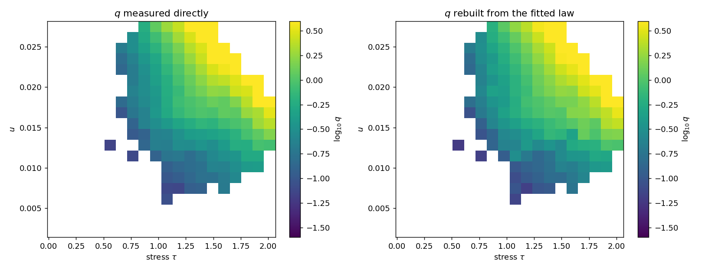

**Figure 8 — measured next to rebuilt.** The measured q field (left) beside
the q field rebuilt from the fitted law (right), on identical color scales.
They are near-duplicates across the map, including the elastic floor at low
u and the softening region (q > 1) in the high-u, high-τ corner.

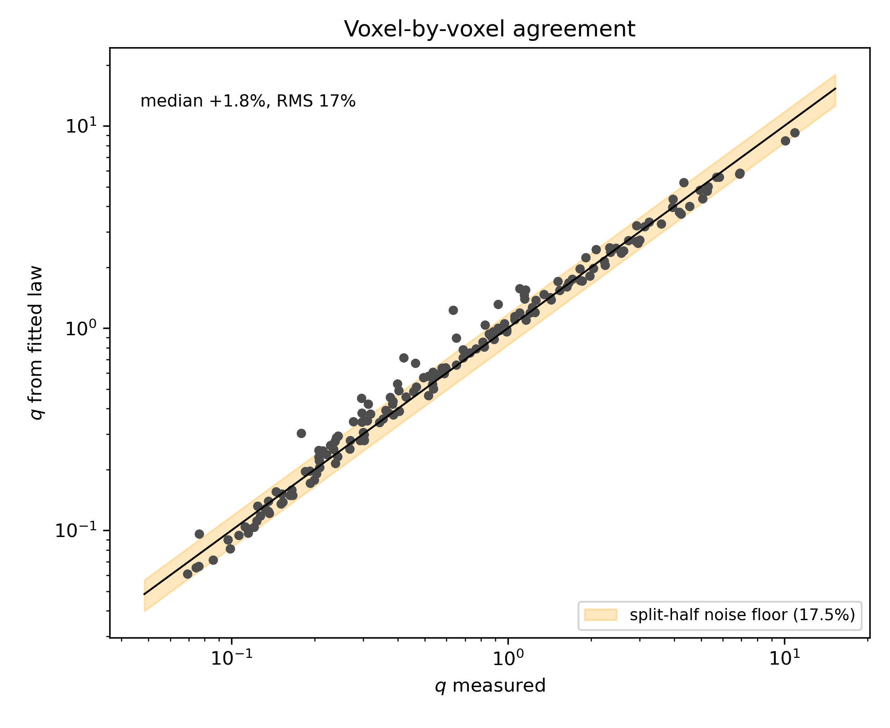

**Figure 9 — the same comparison, voxel by voxel.** Each dot is one grid
cell, across two decades of q. The shaded band is this grid's statistical
noise floor (17.5%, from split-half ensembles). The reconstruction lands at
median +1.8%, RMS 17% — **the fitted law reproduces the plastic-rate field
to within the data's own noise.** There is no headroom left; a better law
could not score better on this test.

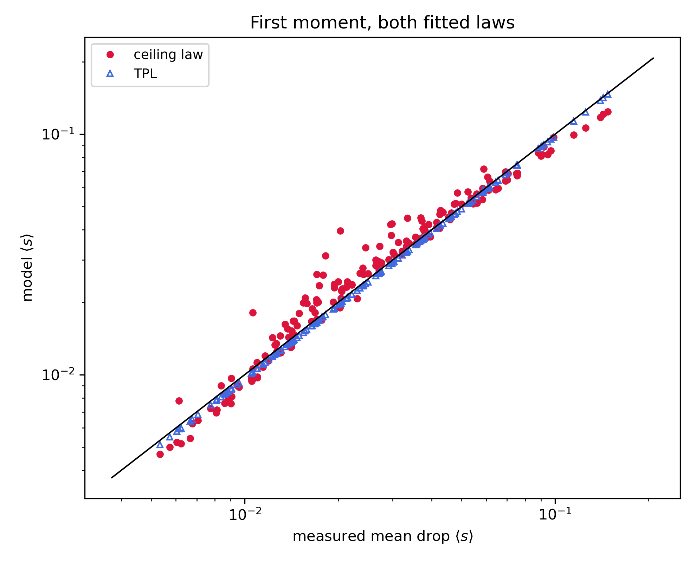

**Figure 10 — where the ceiling matters and where it doesn't.** Model mean
sizes against measured ones, for both fitted laws. The TPL (blue) nails
first moments almost by construction — at fixed exponent, fitting its scale
s* *is* moment-matching, an accounting identity rather than evidence for the
exponential tail. The ceiling law (red) earns its moments from a shape
chosen by per-event likelihood: unbiased, with ~17% scatter. Mean-level
quantities cannot discriminate the two tails — which is exactly why Section
4 argued at the per-event level.

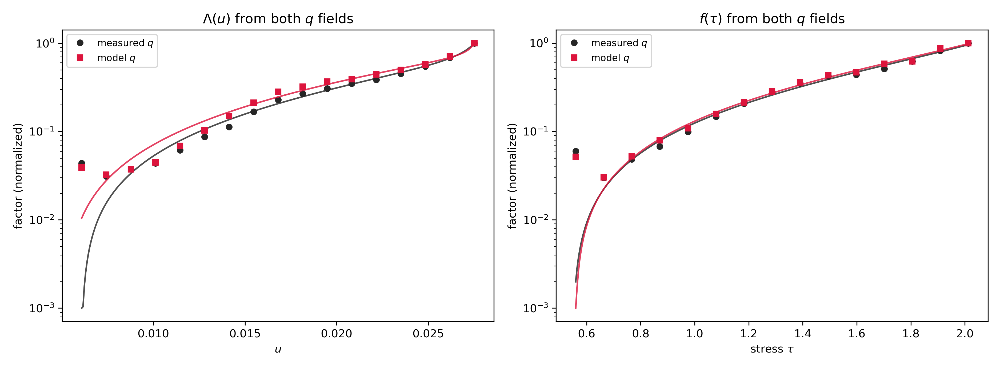

**Figure 11 — the first pass's factor analysis, run twice.** Once on
measured q (black), once on model-rebuilt q (red). Both factorize at 96%;
the factors lie on top of each other; and symbolic regression, run
independently on each version, returns the **same functional knee with
nearly the same constants**. For f(τ), right panel: τ·log(1/τ − 0.44) from
measured q vs τ·log(1/τ − 0.43) from the model. For Λ(u), left panel: a
form with a **pole at u = 0.0287** (measured) vs u = 0.0280 (model) — a
divergence of plastic activity sitting just past the edge of the sampled
range (largest u-bin center 0.0275) and just above the attractor the
dynamics heads toward (u ≈ 0.0255; Figure 15). The first pass's downstream
analytic structure is fully recoverable from the fitted event law; none of
it depended on measuring q directly.

## 8. The acid test: simulating all 850 runs

If the model — two drift fields, the hazard, the jump kernel, and P(s|u,τ) —
really is the dynamics, it should be able to *replace* the MD. So we ran it
forward: 850 synthetic trajectories from the measured initial conditions,
step by step at Δγ = 10⁻⁵, drawing every event size from the fitted law. And
because the law is the part on trial, the identical simulation was run three
ways: sizes from the ceiling law, sizes from the fitted TPL, and sizes
resampled from the raw per-voxel catalogs (the "cheating" arm — as well as
any size model could possibly do here).

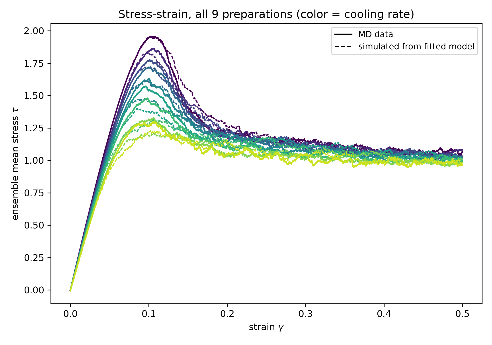

**Figure 12 — the stress–strain curves, predicted.** Ensemble curves for all
nine preparations (color = cooling rate): MD solid, model dashed. The model
reproduces the elastic rise, the ordering and height of the stress
overshoot across a 256× range of cooling rate, the post-yield decay, and
the flow plateau (flow stresses at γ = 0.5 within ±5%). None of these
curves was fit directly — they emerge from fields measured at the
single-step level.

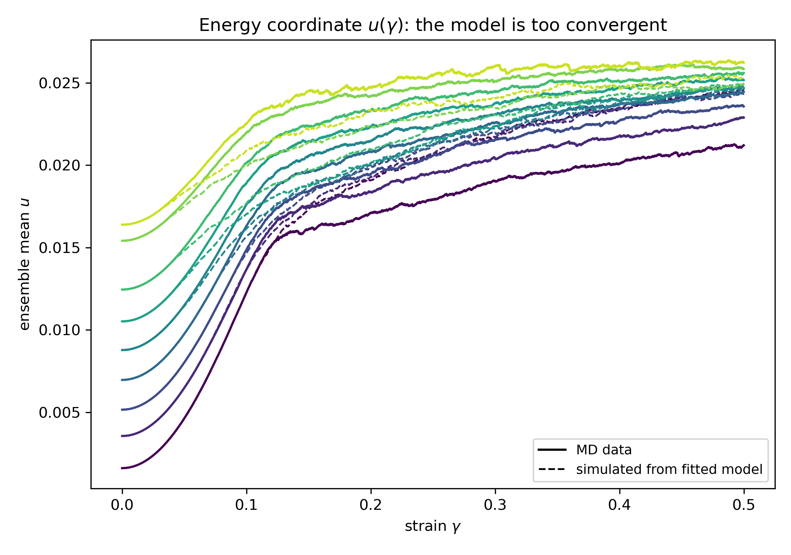

**Figure 13 — the energy coordinate, and the first crack.** The same
comparison for u(γ). The model is good early and visibly too *convergent*
late: the dashed curves pinch together faster than the data's — the real
curves keep a 23.7% spread at γ = 0.5 where the simulation keeps only 4%.
Keep this figure in mind for Figure 15.

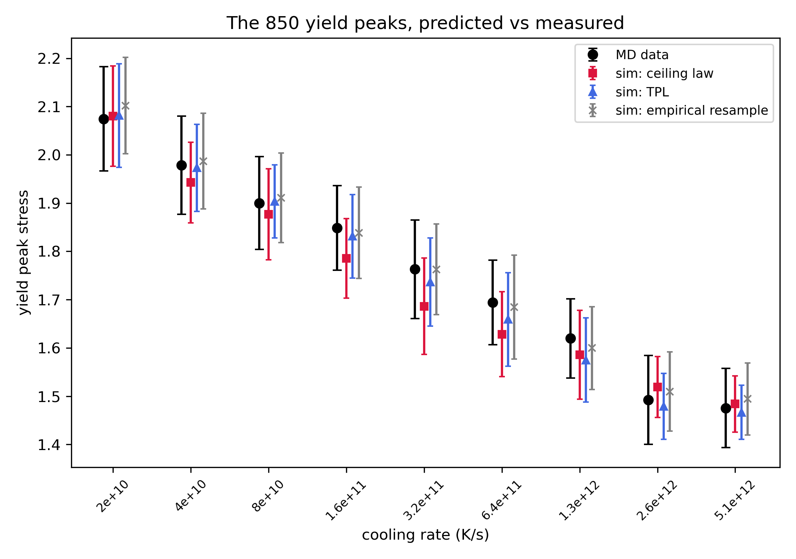

**Figure 14 — the 850 yield peaks.** The distribution of maximum stress per
run, by preparation. Black: MD. The three simulation arms bracket the data:
empirical resampling at 0.9% RMS, TPL at 1.4%, ceiling law at 2.5% (worst
single rate 4.3%). Two honest readings. First, the model predicts the
yield-strength distribution of a glass from its preparation history to a
few percent. Second, the *differences between size laws are smaller than
the differences between preparations* — macroscopic observables feel only
the law's mean, so they are the wrong place to identify tail shape (Section
4's per-event likelihood is the right place).

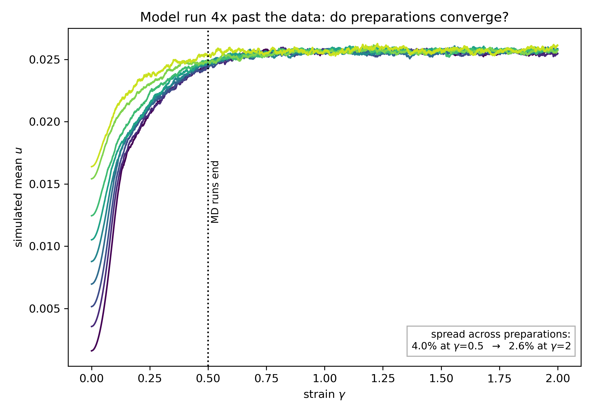

**Figure 15 — the model run 4× past the data.** What the model says about
the question the data cannot answer: no MD run reached steady state by
γ = 0.5. Run further, the model's nine preparations converge onto a common
attractor u∞ ≈ 0.0255 by γ ≈ 1, the preparation spread shrinking from 4.0%
to 2.6%. **Treat this as the model's opinion, not as evidence**: its fields
are preparation-blind by construction (one shared map for all histories),
so eventual convergence is baked in. The data's own verdict is Figure 13 —
the 5×-too-small u-spread is the same missing state variable as Figure 7,
seen macroscopically. This, quantitatively, is the model's failure mode,
and it is the strongest argument in this repository for runs past γ = 0.5
and for a third state variable.

## 9. Where the preparation memory lives

Sections 6 and 8 ended on the same open problem from two directions: at the
same (u,τ), slow-cooled glass produces larger events than fast-cooled glass
(Figure 7), and the simulation lets the nine preparations converge five
times faster than the data do (Figures 13, 15). Both say (u,τ) is not a
sufficient state. This section asks the sharper question: **through which
channel of the step process does the missing variable act?** The step
process has four channels — the event hazard p, the event-size law P(s|u,τ),
the elastic drift, and the aging channel — and each can be re-measured
separately for each cooling rate at fixed (u,τ), then regressed on
ln(cooling rate) with cell fixed effects. The slope β of that regression is
a "memory exponent": β = 0 means the channel is preparation-blind at fixed
state (what the model assumes everywhere), and (rate₁/rate₂)^β is the
predicted ratio between preparations. A control repeats the whole
calculation with trajectories split by parity instead of by cooling rate
(same preparation mix on both sides), which gives the null spread.

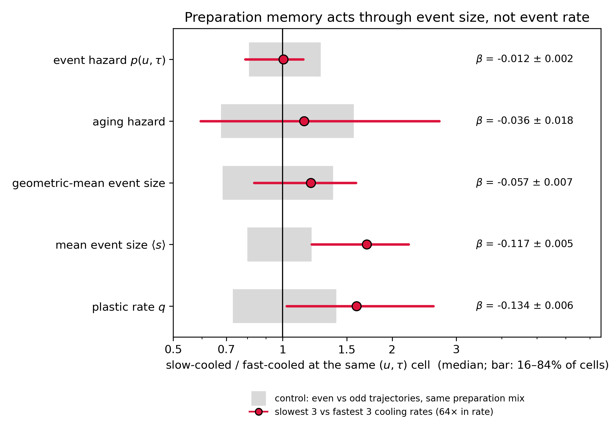

**Figure 16 — memory acts through event size, not event rate.** Red: the
slowest-3 versus fastest-3 cooling rates (a 64× ratio in rate) at the same
cell, median over cells with the 16–84% range; grey: the parity control.
The **event hazard is preparation-blind**: slow/fast ratio 1.005 (control
1.02), β = −0.012 ± 0.002. So is the elastic drift: the per-step energy
drift differs between preparations by 0.005 × 10⁻⁶ against a typical
magnitude of 1.1 × 10⁻⁶ (not plotted because it is a signed difference, not
a ratio). Aging is too sparse to decide (61 cells; the control band covers
it). The memory sits in the **size law**: mean event size ratio 1.70,
β = −0.117 ± 0.005, exactly the 1.71× ceiling ratio of Figure 7 measured a
different way — and it sits in the *tail*: the geometric-mean size, which
is dominated by the many small events, moves only 1.20×. The plastic rate q
inherits the size memory (1.60×) because q = hazard × mean size and the
hazard does not move. In words: **a slow-cooled glass at the same energy and
stress is triggered exactly as often as a fast-cooled one, but its
avalanches run further.**

The same statistics say why this produces the u-spread failure. The mean
energy step per strain step, ⟨du⟩, differs between the slow-3 and fast-3
preparations by −0.57 × 10⁻⁶ at fixed cell — as large as the typical value
of ⟨du⟩ itself (0.5 × 10⁻⁶) — and that difference comes *entirely* from the
event channel (elastic: +0.001, aging: −0.001, in the same units). Bigger
events release more energy, so slow-cooled glass at the same u climbs in
energy more slowly than fast-cooled glass at the same u, and the two never
meet. A per-event regression (70 cells) splits the −111 ± 9 × 10⁻⁶
difference in energy released per event into −81 from event size and
−30 ± 3 from the energy-per-unit-size coupling at fixed size, u and τ:
**73% of the per-event memory is the ceiling; 27% is a secondary memory in
the coupling.**

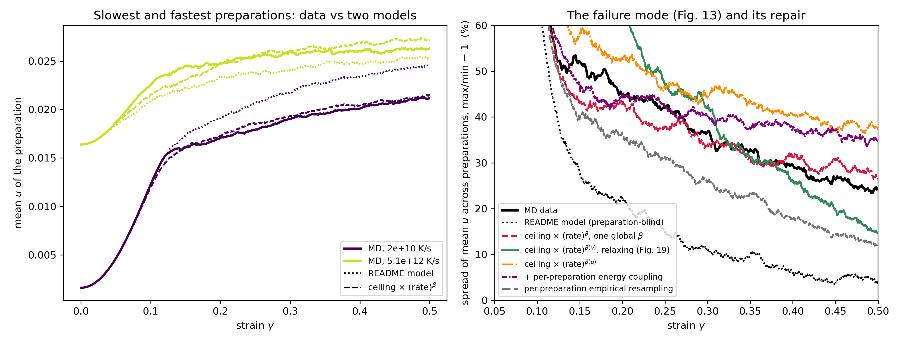

**Figure 17 — a one-parameter memory in the ceiling repairs the failure
mode.** The forward simulation of Section 8 re-run with a single change:
the ceiling of the size law is scaled per preparation,
s_c(u,τ; rate) = s_c(u,τ) · (rate/rate_mid)^β with the *one* global
β = −0.117 from Figure 16 (factors 1.38 … 0.72 across the nine rates).
Hazard, drift, aging and the energy coupling are untouched. Left: the
slowest and fastest preparations — data (solid), the Section-8 model
(dotted), the ceiling-memory model (dashed). Right: the spread of mean u
across preparations (max/min − 1) against strain. The preparation-blind
model collapses to 4.1% at γ = 0.5 where the data keep 24%; the
one-parameter ceiling memory gives **26.5%** (34% vs 37% at γ = 0.3), and
tracks the data curve across the whole strain window. The yield-peak
accuracy is essentially unchanged (RMS 2.5% → 2.8%): the memory acts on the
energy coordinate, not on the stress. Two refinements both *overshoot*:
letting β vary by u band (−0.27 at u ≈ 0.011–0.016 to −0.06 at u ≈
0.024–0.028) gives 37%, and adding the per-preparation coupling gives 35%.
The per-preparation *empirical* resampling arm undershoots (12%) for a
prosaic reason — it needs ≥ 40 events per cell *per preparation group* and
falls back to the pooled table where it has fewer, which is precisely the
cold, slow-cooled region where the memory is largest. The defensible
statement is therefore the simple one: **the missing state variable, to the
resolution of this dataset, is a single multiplicative factor on the
ceiling.**

What kind of variable is it? Two things the data say, and one they cannot.
First, the memory is strongest where the glass is cold and loaded (β ≈
−0.27 at low u, −0.23 at τ > 1.55) and weakest in the flowing state (−0.06
at the highest u): it is a property of the *structure the shear has not yet
erased*. Second, measured at fixed cell in successive strain windows, the
slow/fast size ratio falls from 1.96 (γ = 0.1–0.2) to 1.09 (γ = 0.4–0.5)
— but the cells available in each window differ, and only three cells have
enough events in both preparations both early and late (there the ratio
goes 1.43 → 1.32). Slow/fast pairs are too sparse to separate "the hidden
variable relaxes with strain" from "its effect is weaker at high u"; the
nine-rate regression below (Figure 19) can, and says it relaxes. Third, the dataset
records only strain, stress, energy and cooling rate — there is no other
per-step observable in `df_clean.pkl` to test as the third variable; that
would need new output from the MD (e.g. a local structural order or
soft-mode measure written alongside pe).

For the STZ reading, this cuts against the simplest one-variable version:
in STZ theory the preparation enters through the STZ density, which would
show up in *how often* events fire at a given state, and that is the one
channel that shows no memory at all. What differs is how far a triggered
rearrangement propagates — an avalanche-size, not an activation, property.
(Reader's note: this is the result least favourable to the lab's own
framework in this repository, so it was checked hardest — the hazard's
β = −0.012 ± 0.002 is a fixed-effects estimate over 154 cells with its
control at 1.02.)

**The ceiling is not just the largest event.** A reviewer's first
objection to a bounded-support law fitted by maximum likelihood is that the
ceiling merely tracks the sample maximum. It does track it: refitting each
of the eight largest cells with the top 1, 5 or 1% of events removed moves
s_c almost one-for-one with the new maximum (Figure 18, red; c/smax is
1.02–1.09 in seven cells, 1.26 in one). The question is whether a *true*
ceiling would do the same at n ≈ 5,000 with m ≈ 2, where the density
vanishes so gently near s_c that the largest sample is expected to sit a
few percent below it. It does: synthetic catalogs drawn from the fitted law
with the same n (green) give c/smax = 1.02–1.12 and the same one-for-one
tracking. Synthetic catalogs from the fitted *TPL* (blue) behave completely
differently under the same fit — the ceiling runs off to 3–350× the
maximum (the exponential limit) and the refits collapse by 10–1000×. The
data are on the green line, not the blue cloud.

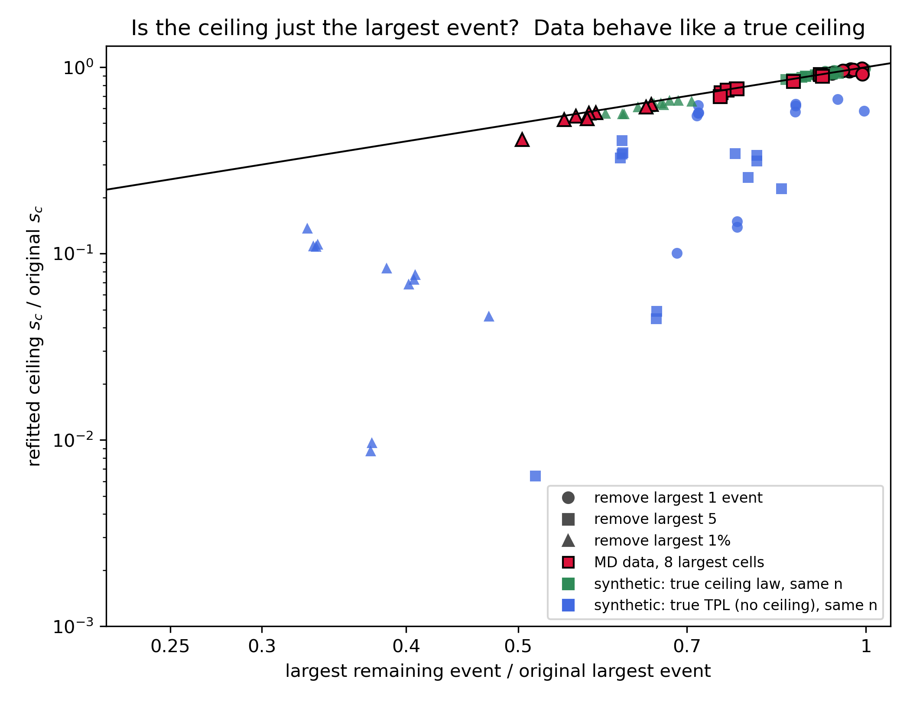

**Figure 18 — the drop-the-largest test.** Refitted ceiling against the
largest remaining event, both relative to the full-sample values; the line
is 1:1. Data (red, 8 cells × 3 removals) lie on top of the true-ceiling
synthetics (green) and nowhere near the TPL synthetics (blue). What this
does *not* remove is the practical sensitivity: s_c in a cell is set by its
ten or so largest events, so its 6.5% bootstrap error is a floor, and
cells with fewer than ~1,000 events should be read as order-of-magnitude.

**The memory relaxes with strain.** Using all nine cooling rates instead
of slow/fast pairs, and a fixed effect for every (cell, strain-window)
pair so that any strain dependence of the size itself is absorbed, the
memory exponent can be measured window by window. It decays: β = −0.210 ±
0.014 at γ = 0.1–0.2, −0.107 at 0.2–0.3, −0.048 at 0.3–0.4, −0.041 ±
0.009 at 0.4–0.5 — and it decays *within* each band of u (Figure 19,
left), which is what separates relaxation from state dependence. An
exponential fit gives a strain constant γ_r ≈ 0.18. So the third variable
is not a frozen label: it is erased by plastic strain, on a scale of a few
tenths of unit strain — the same scale on which Figure 15's model
convergence happens, now measured rather than assumed.

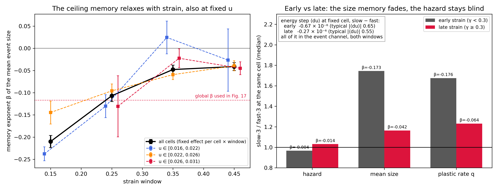

**Figure 19 — relaxation, and what is left late.** Left: β per strain
window, all cells (black) and three u bands (colour). Right: the
slow-3/fast-3 ratios of Figure 16 split at γ = 0.3. The size memory falls
from 1.75× to 1.16×; the hazard stays blind in both windows (0.97, 1.03).
But the energy-step memory only halves (−0.67 → −0.27 × 10⁻⁶ per step at
fixed cell, against a typical |⟨du⟩| of 0.55), and the per-event regression
says why: at late strain a third of the energy-release difference is in the
coupling at fixed size (−18 ± 3 of −47 × 10⁻⁶), not in the size. This is
why the simulation with a *relaxing* ceiling memory (Figure 17, green: β(γ)
taken from the left panel) reproduces the spread at γ = 0.3 (35% vs 37%)
but under-predicts it at γ = 0.5 (13.7% vs 24%), while the flat global β
lands on both by averaging. The honest model statement: **the ceiling
memory relaxes with γ_r ≈ 0.2; a smaller memory in the energy released per
unit event size persists to the end of the data**, and the two together
keep the preparations apart. Whether the coupling memory also relaxes needs
γ > 0.5.

**The step process is not Markov at the step scale.** A different test,
aimed at the hazard rather than the size law: the run-to-run scatter of u
and τ *within* a preparation, which feels the variance of the event
process rather than its mean. All three Section-8 arms over-predict it by
25–30% near yield, the ceiling law no worse than the others — so the
excess is not the size law. Decomposed per strain window (Figure 20,
right), the data's event *counts* are over-dispersed relative to the
model (Fano factor 1.3–1.6 against ≈ 1.0) while the *total stress released*
per window is less variable than the model's (CV 0.10 vs 0.13). The
mechanism is in the step sequence itself (Figure 20, left): at the same
cell, the hazard on the step immediately after an event is **20×** the
hazard after eight quiet steps, decaying to baseline over ~5 steps (5 ×
10⁻⁵ strain); 14% of events sit in runs of consecutive event steps against
a Markov expectation of 0.4%; and the event that follows an event is
1.2× *larger*, not smaller. This is an aftershock (or split-avalanche)
structure that no function of (u,τ) can produce, and it is the first
place in this repository where the Markov-in-(u,τ) assumption of Section 3
fails outright rather than through a missing slow variable.

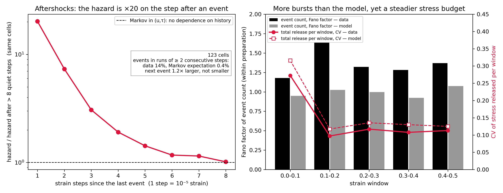

**Figure 20 — aftershocks.** Left: hazard against strain steps since the
last event, relative to the quiet baseline, pooled over 123 cells. Right:
per strain window, the within-preparation Fano factor of the event count
(bars) and the coefficient of variation of the total stress released
(lines), data vs the ceiling-law simulation started from the same 850
initial states.

Does the split-avalanche reading threaten the size law? If a run of
consecutive drop steps is one physical avalanche, the per-step catalog
under-counts large events. Merging every run into a single event (187,468
steps → 172,135 avalanches; 11,472 runs of two or more steps, the longest
16) and repeating the likelihood contest on the eight largest cells: the
ceiling law wins by *more* (ΔAIC over TPL 117–213, was 67–120; over
lognormal 274–669), the ceilings move by < 2% (0.505 → 0.499 in the
largest cell), m stays in the 1–3 range, and k shifts from 0.92–1.02 to
0.96–1.09. The law is robust to the event definition; the small-size
exponent is the only quantity that notices, by about +0.05.

## 10. The modeling choices, and why

1. **Drift + jump decomposition.** Not assumed — AQS dynamics *is* elastic
   branches punctuated by discrete events. The decomposition is exact
   bookkeeping; all modeling risk is pushed into the three ingredients,
   where each can be tested separately.
2. **20×20 state grid.** Finer than the first pass's 10×10, as befits a pass
   whose subject is distributions rather than means. The price is a higher
   per-voxel noise floor (17.5% vs 11.3% split-half); every "at the floor"
   claim above uses the recomputed floor, not the old one.
3. **Form discovery by exhaustive enumeration, not genetic search.** The
   headline claim is a *negative* one ("no exponential tail survives"), and
   negative claims require a search you can prove was complete. Counts:
   624,936 trees per target at complexity ≤ 8, spot-checked at ≤ 9 with
   4,505,024.
4. **Poisson-weighted binned target for SR; likelihood for selection.**
   Binned least squares is what makes an exhaustive search affordable; it is
   *not* how a winner gets picked (it over-weights crowded bins and produced
   one artifact form that likelihood killed at ΔAIC +20,000). Division of
   labor: SR proposes structures, normalized MLE with AIC and
   trajectory-blocked CV disposes.
5. **Trajectory-blocked validation.** Events within a run are correlated;
   splitting by event would leak information. All cross-validation splits
   are by whole trajectory, as in the first pass.
6. **Global (k, m, ε), local s_c.** Justified three ways: the fitted
   exponents are flat across cells (k spread ±0.05); the collapse in
   Fig. 2 works with all shape freedom removed; and the rank-1 structure
   of s_c says the one local parameter is itself low-dimensional. Refitting
   ε per cell moves it ±2× with no AIC gain — kept global.
7. **m decoupled from k.** SR's complexity budget first delivered the law
   with a single exponent (m = k); likelihood preferred decoupling in 8/8
   large cells, and the tied version biased mean sizes by +10%. We report
   the tied form as the *discovery* and the decoupled form as the *fit* —
   that is the honest division.
8. **No lower size cutoff.** The ε-rounding is part of the law, so the fit
   window is "all recorded events" — removing the xmin arbitrariness that
   plagued first-pass exponent estimates (the old κ drifted 1.2→1.6 with
   xmin; k now moves only 0.85→1.03 under far larger window changes, and
   the first pass's κ ≈ 0.95 is recovered as the mid-range slope).
9. **Aging events as a separate exponential channel.** 36% of events, but
   they carry no stress drop; they matter only for u-bookkeeping. An
   exponential per-voxel size model is the least structure that keeps the
   u-drift honest; nothing downstream is sensitive to this choice.
10. **Three simulation arms.** The empirical-resampling arm bounds what any
    size law could achieve; the TPL arm is the ablation. Differences between
    arms measure how much the law's *form* matters for each observable —
    which is how Fig. 14 can honestly conclude "peaks don't discriminate
    tails" instead of over-claiming a win.

## 11. What holds, what doesn't

| claim | status |
|---|---|
| Event sizes follow one universal shape with a single state-dependent scale | **supported** (Fig. 2: 12 cells spanning 100× in scale collapse) |
| The large-size cutoff is a hard ceiling, sharper than exponential | **supported where testable** (8/8 AIC, synthetic controls pass both directions); degenerate in sparse cells |
| Small-size exponent k ≈ 0.9 | **supported**, ±0.1 window systematic |
| Ceiling exponent m ≈ 2 | order-of-magnitude only |
| The ceiling field factorizes; its u-factor is activated-like | factorization **supported** (96%); the specific factor forms are best-of-front, not unique |
| The fitted law reproduces the plastic-rate field q | **at the noise floor** (Fig. 9) — this test is saturated |
| The fitted model reproduces stress–strain curves and yield peaks across 256× in cooling rate | **supported**, few-percent level (Figs. 12, 14) |
| (u,τ) is a sufficient state | **contradicted, again, independently**: 1.71× ceiling memory (Fig. 7) and 5×-underpredicted u-spread (Figs. 13, 15) |
| The missing variable acts through the event-size ceiling only | **supported** (Fig. 16): hazard and elastic drift preparation-blind (β = −0.012 ± 0.002, drift difference 0.5% of typical); size β = −0.117 ± 0.005; a 27% secondary memory in the energy coupling |
| A one-parameter ceiling memory repairs the u-spread | **supported** (Fig. 17): 4.1% → 26.5% against 24% in the data, peaks unchanged; refinements overshoot |
| The ceiling is a property of the distribution, not of the largest event | **supported** (Fig. 18): data track the sample maximum exactly as true-ceiling synthetics do; TPL synthetics do not |
| The hidden variable relaxes with strain | **supported** (Fig. 19): β falls −0.21 → −0.04 from γ = 0.15 to 0.45 within fixed u bands; γ_r ≈ 0.2; a smaller energy-coupling memory persists to γ = 0.5 |
| The step process is Markov in (u,τ) at the 10⁻⁵ strain scale | **contradicted** (Fig. 20): hazard ×20 on the step after an event, 5-step aftershock decay; count Fano 1.3–1.6 vs 1.0; run-to-run scatter over-predicted by 25–30% |
| The ceiling law survives merging consecutive drop steps into avalanches | **supported**: ΔAIC over TPL grows to 117–213; s_c moves < 2%; k shifts +0.05 |
| Steady state / convergence of preparations | not in the data; the model's convergence prediction (Fig. 15) is structurally baked in — needs longer runs |

**Next, in order of value:** (0) an aftershock term in the hazard — a
two-state hazard p(u,τ) × (1 + A e^{−n/n_r}) with n the steps since the
last event, fitted from Figure 20 (A ≈ 19, n_r ≈ 2) — and the forward
simulation re-run to see whether it closes the 25–30% variance gap; this is
the cheapest model change in the repository and the only one that targets
a *hazard* failure; (1) longer strain runs — every open question above
touches γ > 0.5, and whether the coupling memory relaxes like the ceiling
memory (γ_r ≈ 0.2) needs one preparation followed to γ ≈ 2; (2) a per-step
structural observable written by the MD alongside pe (the dataset has none),
to be tested against a single target: does it absorb the β = −0.117 memory
exponent of the ceiling while leaving the hazard's β at zero; (3) the
system size N, ideally a second size, to test the finite-size reading of
the ceiling; (4) reverse loading, unchanged from the first pass.

## 12. What's in the repository

| file | contents |
|---|---|
| [pipeline/run_all.sh](pipeline/run_all.sh) | **reproduces every number and figure in this document** from `df_clean.pkl` (~35 min on 8 cores); each step is one script in `pipeline/`, outputs land in the gitignored `pipeline/out/` |
| [pipeline/extract2.py](pipeline/extract2.py) | event catalog and per-cell sufficient statistics on the 22×22 grid (Section 1) |
| [pipeline/discover_dist.py](pipeline/discover_dist.py), [pipeline/sr_deep9.py](pipeline/sr_deep9.py) | the symbolic-regression fleet and the complexity-9 audit (Section 4) |
| [pipeline/mle_compare.py](pipeline/mle_compare.py), [pipeline/synth_check.py](pipeline/synth_check.py) | likelihood adjudication and the falsifiability controls (Sections 4–5) |
| [pipeline/scale_field.py](pipeline/scale_field.py), [pipeline/refit_m.py](pipeline/refit_m.py) | the ceiling field, its factorization and bootstrap, the m/k decoupling (Section 6) |
| [pipeline/fields.py](pipeline/fields.py), [pipeline/reconstruct.py](pipeline/reconstruct.py), [pipeline/recon4.py](pipeline/recon4.py) | measured fields; q rebuilt from the law; Λ/f factors (Section 7) |
| [pipeline/simulate.py](pipeline/simulate.py), [pipeline/sim_run.py](pipeline/sim_run.py) | the forward simulator and its three arms (Section 8) |
| [pipeline/memory_where.py](pipeline/memory_where.py), [pipeline/coupling_memory.py](pipeline/coupling_memory.py), [pipeline/memory_fading.py](pipeline/memory_fading.py), [pipeline/sim_memory.py](pipeline/sim_memory.py) | where the memory lives, and the repair (Section 9) |
| [pipeline/ceiling_pinning.py](pipeline/ceiling_pinning.py), [pipeline/ceiling_pinning_synth.py](pipeline/ceiling_pinning_synth.py) | the drop-the-largest test and its synthetic control (Section 9) |
| [pipeline/memory_2d.py](pipeline/memory_2d.py), [pipeline/memory_late.py](pipeline/memory_late.py) | memory exponent by strain window and u band; channel table early vs late (Fig. 19) |
| [pipeline/scatter_test.py](pipeline/scatter_test.py), [pipeline/scatter2.py](pipeline/scatter2.py), [pipeline/cluster_test.py](pipeline/cluster_test.py), [pipeline/merged_events.py](pipeline/merged_events.py) | within-preparation scatter, aftershock hazard, merged-avalanche likelihood contest (Fig. 20) |
| [pipeline/make_figs_single.py](pipeline/make_figs_single.py), [pipeline/make_figs_memory.py](pipeline/make_figs_memory.py) | Figures 1–15 and 16–20 |
| [library/symreg.py](library/symreg.py) | the exhaustive symbolic-regression engine (grammar, variable projection, fingerprint dedup, exact Pareto fronts) |
| [library/dist.py](library/dist.py) | normalized-MLE machinery: candidate densities, AIC, trajectory-blocked CV, moments, sampling |
| [library/stz.py](library/stz.py), [library/avalanche.py](library/avalanche.py) | first-pass field extraction and TPL fitting (kept for comparison) |
| [REPORT.md](REPORT.md) | first-pass technical report (measured-field route + STZ scrutiny) |
| figures/fig01 … fig20 | this pass (one plot per figure; 16–20 are Section 9) |
| figures/state_sufficiency.png … steady_state.png | first pass |

Raw data (`df_clean.pkl`, 2.4 GB) is not distributed with the repository.
Reproduce with

```bash
bash pipeline/run_all.sh
```

The pipeline was re-run from the raw data before this section was written;
every quoted number reproduced (277 ceiling cells spanning 146×, rank-1
share 95.5%, memory ratio 1.71×, k = 0.88, m = 2.27, ε = 2.7 × 10⁻⁵, the
AIC table of Section 4).
