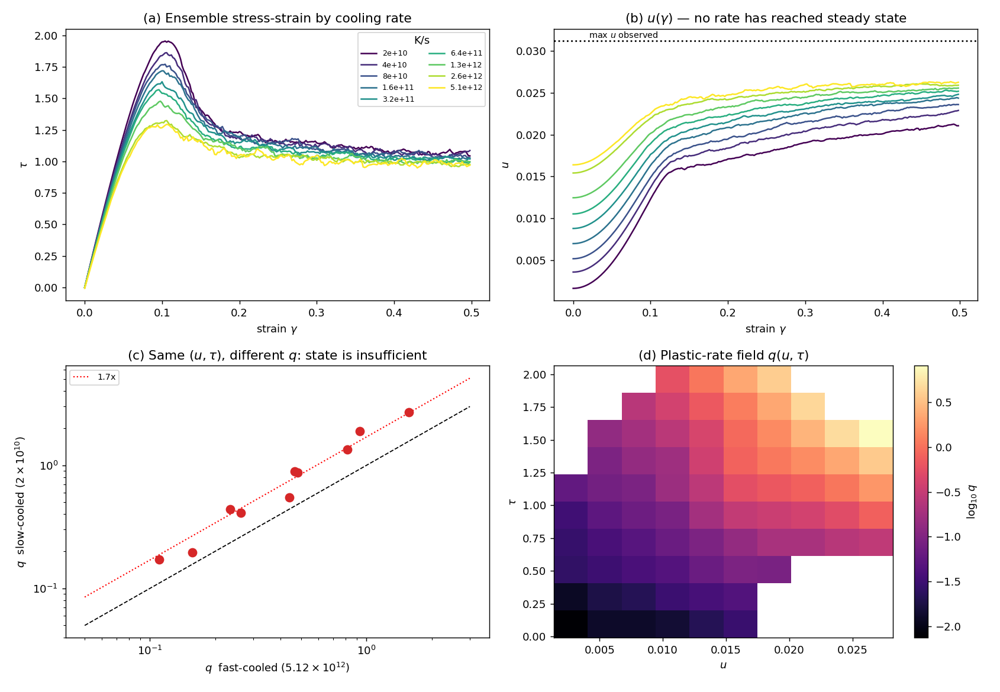
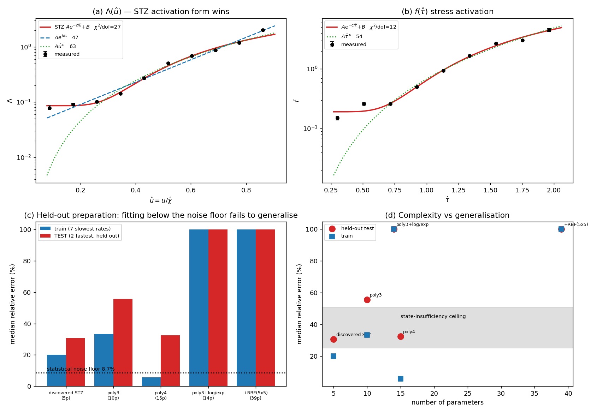
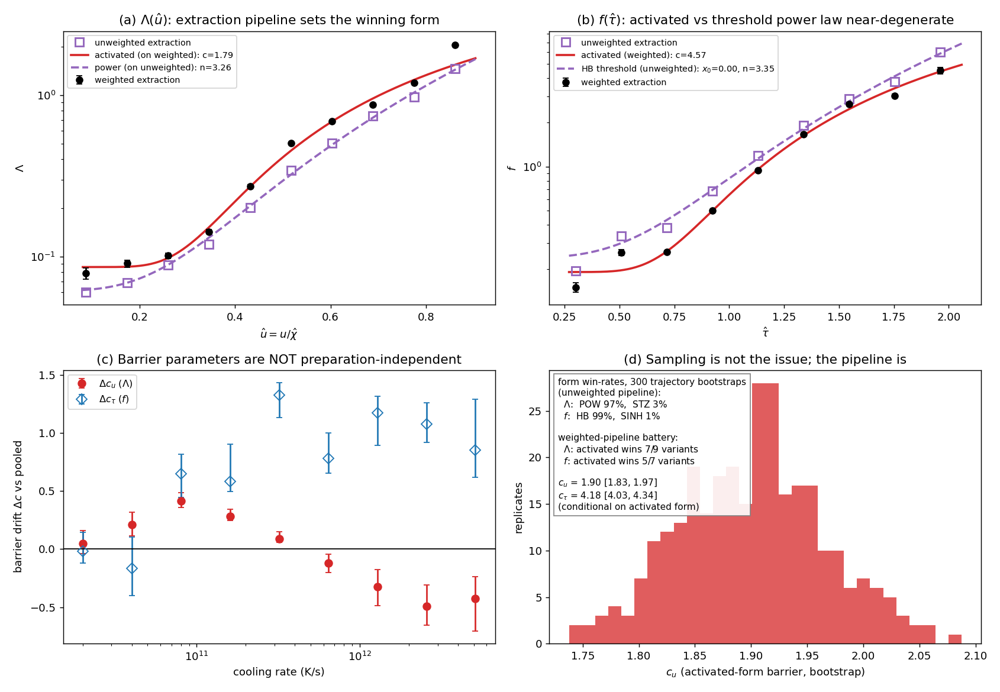
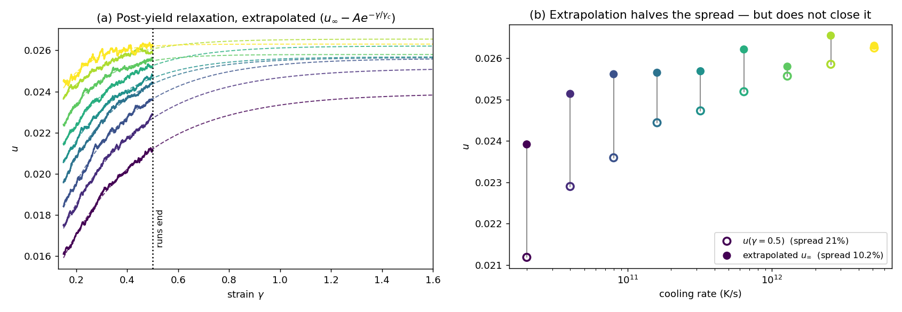
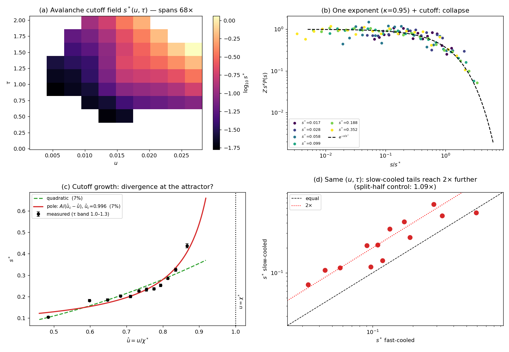

# SEEM: discovering the equations of glassy plasticity

This repository contains a data-driven search for a **constitutive model** — the
equation relating stress, deformation, and internal state — of a simulated glass,
together with an adversarial test of the leading theory in the field (the
shear-transformation-zone, or STZ, theory) and a statistical map of the yield
events themselves. This README is a ~10-minute overview that builds from basics.
The full technical detail lives in [REPORT.md](REPORT.md), and a slide version in
`SEEM_project_deck.pptx`.

---

## 1. The question

When you bend a metal past its elastic limit, we know what happens microscopically:
crystal defects called dislocations glide through the lattice, and a century of
theory turns that picture into predictive equations. **Glasses have no lattice**, so
they have no dislocations — yet they still yield, flow, and harden. Their plasticity
happens through localized rearrangements: small clusters of atoms that suddenly
snap from one packing to another.

What's missing is the *equation of motion* for this process — a constitutive law
you could hand to an engineer. The best-developed candidate is **STZ theory**
(Falk & Langer, 1998), which postulates that flow is carried by a sparse population
of "shear-transformation zones" whose abundance is controlled by an **effective
temperature**: not the thermal temperature, but a measure of how much disorder is
frozen into the structure.

This project asks three things:

1. Can we **discover** the constitutive law directly from simulation data, using
   symbolic regression, rather than postulating it?
2. Does what we find **support or contradict STZ theory**? (A disclosure that
   shapes everything below: this work comes from the lab where STZ theory was
   invented, so pro-STZ findings were deliberately subjected to extra scrutiny.)
3. What are the **statistics of the individual yield events** — and could a map of
   that "event landscape" let us describe global yield behavior analytically?

## 2. The data

The dataset is 850 molecular-dynamics simulations of a model glass being sheared,
in the cleanest protocol available: **athermal quasistatic (AQS)** shear. Shear the
box by a tiny increment (10⁻⁵ strain), let every atom settle into mechanical
equilibrium, record, repeat — 49,999 times per sample, out to 50% strain. There is
no thermal noise and no rate dependence; every stress drop is a genuine mechanical
instability.

Crucially, the samples were prepared at **nine different cooling rates** spanning
2×10¹⁰ to 5×10¹² K/s. Cooling rate is to a glass what aging is to cheese: cool
slowly and you get a deep, stable, well-annealed structure; quench fast and you
freeze in a sloppy, high-energy one. This gives us nine materially different
starting points for the *same* substance — the key lever for testing whether a
candidate law is really a law.

Each snapshot reduces to two numbers: the shear stress τ and the packing energy u
(both defined precisely in the glossary below).

**Panel (a)** shows the ensemble stress–strain curves: an elastic ramp, then — for
well-annealed samples only — a stress *overshoot* before settling toward steady
flow. Slower cooling ⇒ higher peak (1.96 vs 1.30 in our units): the material
remembers its preparation. **Panel (b)** shows u climbing during shear for all nine
preparations: deformation "reheats" the structure toward a common band. Note that
none of the curves has flattened by the end of the run — this matters later.
(Panels (c) and (d) are explained in §5 and §8.)

## 3. The variables, all in one place

| Symbol | Plain reading |
|---|---|
| **γ** | Applied shear strain — the "time" axis of every plot; runs 0 → 0.5. |
| **τ** | Shear stress (raw stress / 10⁴, in simulation units). |
| **u** | Potential energy per atom above the reference u₀ — *how badly packed the structure is*. The stand-in for STZ theory's effective temperature. |
| **u₀** | The reference energy the dataset measures u against. Derived from the data itself, not independently known — an important systematic (§7). |
| **χ\*** | The steady-flow attractor of u: the disorder level that sustained shearing drives every sample toward (≈ 0.026–0.031, extrapolated; §9). |
| **û = u/χ\*** | u on a 0-to-1 scale; û ≈ 1 means fully rejuvenated. |
| **2μ(u,τ)** | Elastic stiffness: stress gained per unit strain on the smooth stretches between events. |
| **q(u,τ)** | Plastic fraction: of the strain just applied, the share that went into permanent rearrangement. 0 = purely elastic, 1 = steady flow, >1 = softening. |
| **Λ(u), f(τ)** | The two factors of q ≈ Λ·f — the energy-dependence and stress-dependence of plasticity, separated (§5). |
| **e_Z** | If Λ is activated (Boltzmann-like), the fitted formation energy of a flow defect (≈ 0.056 per-atom energy units). |
| **λ(u,τ)** | Event rate: how many yield events fire per unit strain from a given state. |
| **s** | Avalanche size: the stress released by one yield event, s = −Δτ. |
| **κ** | The universal power-law exponent of avalanche sizes (≈ 0.95; §10). |
| **s\*(u,τ)** | The avalanche ceiling: the largest event size a given state typically produces (§10). |
| **γ_p** | Accumulated plastic strain — a candidate third state variable (§8). |
| **ρ₀** | Where a preparation starts: the initial distribution of samples over (u, τ). |

## 4. Why the obvious approach fails

The naive plan: fit an equation dτ/dγ = F(u, τ) to the 42 million recorded steps.
This fails spectacularly (R² ≈ 0.0005), and understanding why shapes everything
downstream. Glassy deformation is **smooth elastic loading interrupted by rare,
violent avalanches** — the strain-rate signal spans five orders of magnitude, and
least squares chases the avalanches while ignoring the physics in between.

The fix is to stop regressing and start *measuring*, after splitting the dynamics
into parts that each behave well: the elastic stiffness 2μ from the smooth
segments, and the plastic fraction

**q(u, τ) = 1 − (dτ/dγ) / 2μ**

which has clean limits and is O(1) everywhere.

One more habit adopted throughout: **measure the noise floor before fitting
anything.** Splitting identically-prepared samples in half and comparing gives an
11.3% floor; per-cell statistical error is 8.7%. Any model that "fits" better than
the floor is memorizing noise — this rule ends up doing a lot of work below.

## 5. What q looks like — and a lucky break

Panel (d) of the first figure maps q over the (u, τ) plane. It behaves like a
constitutive field should: near zero in the cold/unloaded corner, rising toward 1
at flow, monotone in both variables. And it has one big structural simplicity —
it **factorizes**:

**q(u, τ) ≈ Λ(u) · f(τ)**

like a surface built from a row profile times a column profile. A rank-1 model
captures 96% of the variation in log q. That splits the discovery problem into two
one-dimensional ones: Λ(u), how plasticity grows as the structure gets
configurationally hotter (26-fold across our range), and f(τ), how stress
activates rearrangements (~30-fold).

In STZ language, Λ is proportional to the population of shear-transformation
zones, and f is the stress-driven rate at which each one fires. The factorized
form is itself an STZ prediction, so finding it empirically is the first
substantive point on the theory's scoreboard.

## 6. Machine-discovering the equations

With two clean 1-D targets, we used **symbolic regression**: instead of fitting
coefficients in a fixed formula, search over the *space of formulas themselves*
(sums, products, powers, exponentials, logs...) for the best trade-off between
accuracy and simplicity. Because each target has only ~10–20 well-measured points,
we could afford **exhaustive enumeration** — every expression up to a complexity
bound, with constants optimized inside nonlinearities — rather than a stochastic
genetic search. Physics constraints (positivity, monotonicity) are hard filters:
inadmissible formulas are discarded, not penalized. The engine is
[library/symreg.py](library/symreg.py), validated on synthetic problems with known
answers before touching real data.

**Panels (a, b):** at the accuracy-vs-simplicity sweet spot, both factors come out
**activated** — Boltzmann-like:

Λ(û) ≈ 11.6·exp(−1.79/û) + 0.086,  f(τ) ≈ 43.6·exp(−4.57/τ) + 0.19

This is exactly STZ's central object: zone abundance ∝ exp(−formation energy /
effective temperature). The search was not told to look for it — it emerged from
~4,600 admissible candidate expressions.

**Panels (c, d)** show the test that matters: train on the seven slowest cooling
rates, predict the two fastest — preparations the model has never seen. The
discovered 5-parameter model does as well as a 15-parameter polynomial (30.7% vs
32.4% error) — and the polynomial's seemingly stellar training error (5.7%, *below
the noise floor*) is pure memorization. Simple, physically-shaped models
extrapolate; flexible ones flatter you on training data and betray you off it.

## 7. The stress test

Because a pro-STZ result from this lab would be suspect, we ran a pre-specified
battery of robustness checks: different statistical weightings, different modulus
estimators, restricted data ranges, shifted energy references, hundreds of
bootstrap resamples.

The outcome is genuinely mixed, and the mix is the finding:

- **Robust:** the *family* of the laws. Growth-exponentials and sinh forms lose in
  every single variant, for both Λ and f. The shape is a floor plus a stiff rise —
  that much is settled.
- **Not robust:** the *distinction between* the activated form exp(−c/u) and a
  plain power law uⁿ. It flips with the extraction weighting (panel a: the same
  data supports either) and with a small shift in the energy zero-point u₀ —
  which is dataset-derived, not independently measured. Verdict: **undecidable at
  current systematics.** The honest scoreboard: activated wins 7 of 9 weighted
  variants; the power law wins 97–99% of bootstraps on the unweighted pipeline.
- **A clean negative:** if you *do* adopt the activated form, its barrier
  parameter should be a material constant. It isn't — it drifts ±25% across the
  nine preparations, far outside statistical error (panel c).

## 8. The most important result is negative

That barrier drift is a symptom of something bigger, shown back in **panel (c) of
the first figure**: take the slowest-cooled and fastest-cooled ensembles and find
moments where they sit at *identical* (u, τ). They flow at rates differing by a
factor of ~1.7 — consistently, across every well-populated cell, at 4.5× the noise
floor.

Two glasses with the same energy and the same stress behave differently. **The
pair (u, τ) is not a complete description of the material's state** — the glass
remembers more of its history than these two numbers capture. Adding accumulated
plastic strain γ_p as a third variable absorbs about a third of the discrepancy;
the rest points at candidates we cannot test with this dataset: directional
internal stresses ("back-stress" — which is, notably, the very variable STZ theory
includes and we had to omit), or spatial localization of the flow.

This means no two-variable constitutive law — STZ-form or otherwise — can be exact
for this system. It bounds what any equation on this repository's state space can
achieve (~25–50% depending on preparation spread), and the discovered model
already sits at that bound.

## 9. The missing endpoint: steady state

One more structural caveat. Every preparation is still relaxing when the
simulations end at 50% strain:

Fitting the approach to steady state (left: dashed extrapolations, using the
relaxation form the theory itself predicts) says the slowest-cooled samples still
have ~11% of their journey left, and full convergence needs runs 2–3× longer.
Worse (right): the **extrapolated endpoints don't meet** — a 10% spread remains.
Either the relaxation has slower-than-exponential tails, or different preparations
genuinely flow toward different steady states, which would be a second, deeper
violation of effective-temperature theory. Current data cannot tell these apart.

## 10. The yield events themselves

Everything above concerns *averages* — the mean response of the material. The
project's original goal was the **distributions**: the statistics of the
individual yield events, the avalanches that make up the serrated curves. Mapping
them turned out to compress remarkably well, into four findings:

**One event = one number.** Each event drops both the stress and the energy, and
the two drops are locked together (R² = 0.90, tighter still near flow): the energy
released is proportional to the stress released. So an avalanche is characterized
by a single size, s — the stress it lets go of.

**One law for the sizes.** At every point of the state space, sizes follow the
same form: a power law with an exponential ceiling, P(s) ∝ s^−κ·e^(−s/s\*). The
exponent is **universal**, κ ≈ 0.95 — the same everywhere — and this form beats
the standard rival (a lognormal) decisively. Panel (b) below is the proof:
distributions from states whose ceilings differ 20-fold collapse onto a single
curve once rescaled. (An earlier working estimate of κ ≈ 1.35 was an artifact of
fitting the slope while ignoring the ceiling; the joint fit is stable.)

**All the physics is in the ceiling.** The cutoff s\*(u,τ) — the largest avalanche
a state typically produces — is the real landscape: it spans a factor of 68,
grows roughly quadratically with stress, factorizes just as q did, and (panel c)
is consistent with **diverging exactly at the steady-flow attractor** û = 1 — the
signature of steady flow being a *critical state* with system-spanning events.
Consistent with, not proven: a smooth quadratic fits equally well, and deciding
needs the same two things flagged in §9 — longer runs, and a second system size.

**The memory is in the biggest events.** Panel (d): at identical (u, τ),
slow-cooled samples produce avalanches with a 2.0× larger ceiling than
fast-quenched ones (measurement control: 1.09×). Note the ladder across this
whole study — typical jump sizes differ 1.34×, the average flow rate 1.7×, and
the large-event scale 2× between preparations. The hidden state variable of §8 is
concentrated in the most *collective* events, which points suspicion firmly at
spatial structure (incipient shear bands) — testable only with per-atom data.

**Why map this at all?** With κ, the ceiling field s\*(u,τ), the stress-to-energy
drop ratio, and the measured stiffness in hand, the stochastic evolution of a
deforming sample becomes a closed "master equation" whose ingredients are all
measured functions — and the event rate λ comes for free from a consistency
identity (rate × mean event size = plastic flow). Solving that equation, rather
than simulating atoms, is what could deliver the things no mean-field model can:
the sample-to-sample **distribution of yield strengths** (we hold 850 measured
peaks to test against), the serration statistics that experiments actually record,
and an analytic brittle-vs-ductile criterion. That assembly — plus the untouched
"aging" channel of events that drop energy without dropping stress (36% of all
events, concentrated before yield) — is the project's current frontier.

## 11. Where this leaves us

| | |
|---|---|
| **Supported** | Effective-temperature phenomenology; the factorization q = Λ(u)·f(τ); an activated Λ as one of two surviving forms; a universal avalanche exponent with a state-dependent ceiling |
| **Not established** | The Boltzmann form *uniquely*; a preparation-independent formation energy; a common steady-state attractor; any stress threshold in f; ceiling divergence at the attractor (vs smooth growth) |
| **Contradicted** | Sufficiency of any two-variable state; constancy of the barrier across preparations |

Ranked next steps: (1) measure the reference energy u₀ independently — this alone
breaks the activated-vs-power degeneracy; (2) reverse-loading AQS runs from saved
configurations — a direct, cheap test of the back-stress variable; (3) extend or
bracket the steady state; (4) spatial fields to test localization — now doubly
motivated by the memory-in-the-tail result; (5) assemble the master equation from
the mapped landscape (§10) and test it against the 850 measured yield peaks. The
destination is no longer a mean-field fit but a measured, generative law for
yield.

## 12. What's in this repository

| Path | What it is |
|---|---|
| `README.md` | This overview |
| [REPORT.md](REPORT.md) | The full technical report, with the complete robustness battery |
| `SEEM_project_deck.pptx` | 14-slide presentation version |
| [library/stz.py](library/stz.py) | Field extraction: loading, event labeling, modulus, q, hazard, factorization tests |
| [library/symreg.py](library/symreg.py) | The symbolic-regression engine (exhaustive + genetic modes, physics filters) |
| [library/avalanche.py](library/avalanche.py) | Truncated-power-law estimators for the avalanche size statistics (§10) |
| [library/library.py](library/library.py) | Fixed candidate-function library (SINDy baseline arm) |
| `SEEM-model.ipynb` | Original exploratory notebook (voxel SEEM model, first SINDy attempts) |
| `figures/` | All figures referenced above |

**Data:** the underlying trajectory file `df_clean.pkl` (2.4 GB, 42.5M rows) is
gitignored and not distributed here. All voxel-level analysis rebuilds from it in
a single ~6-second pass; the analysis scripts follow a
measure-the-noise-floor-first workflow described in REPORT.md §2 and §5.
